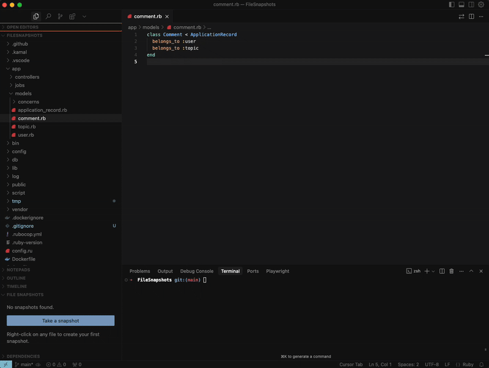

# 📸 File Snapshots

A VS Code extension for creating and managing file snapshots with ease.

## 🎯 What is File Snapshots?

File Snapshots allows you to quickly capture and manage different states of your files directly within VS Code. Whether you're experimenting with code, refactoring, or just want to save a "working version" before making changes, this extension has you covered.

## 🎬 Demo

*See File Snapshots in action - create, compare, restore, and export file snapshots with ease!*

## 🤖 Fun Facts

- **100% AI-Crafted**: This entire extension was brought to life by artificial intelligence. No humans were harmed in the making of this plugin (though several cups of coffee were consumed by the human supervisor).

- **We Know Git Exists**: Before you ask - yes, we're fully aware that Git is a thing, and this plugin isn't trying to replace your beloved version control system. Think of File Snapshots as Git's quirky little cousin who specializes in quick, lightweight snapshots for those "just in case" moments. Perfect for when you want to save a state without the ceremony of a full commit!

## ✨ Features

- 📸 **Quick Snapshots**: Right-click any file to instantly create a snapshot
- 🌳 **Tree View**: Browse all your snapshots in an organized tree structure
- 🔍 **Smart Comparison**: Compare snapshots with current file versions using VS Code's built-in diff viewer
- 🔄 **Easy Restoration**: Restore any file to a previous snapshot state (with automatic backup)
- 💾 **Export Functionality**: Save snapshots as regular files anywhere on your system
- 🗑️ **Clean Management**: Delete unwanted snapshots with confirmation dialogs
- 💾 **Local Storage**: All snapshots are stored locally in your workspace's `.vscode/snapshots` directory

## 🔧 Technical Details

- **Storage**: SQLite database with file content stored separately
- **Location**: `.vscode/snapshots/` directory in your workspace
- **Compatibility**: Works with any text-based file
- **Performance**: Efficient storage with content deduplication
- **Privacy**: All data stays local to your machine

## 🤝 Contributing

While this extension was crafted by AI, human contributions are welcome! Feel free to:

- Report bugs or issues
- Suggest new features
- Submit pull requests
- Share feedback

## 📜 License

This project is licensed under the MIT License - see the [LICENSE](LICENSE) file for details.

## 🙏 Acknowledgments

- Built with ❤️ by AI (with human supervision)
- Powered by VS Code's Extension API
- Icons courtesy of VS Code's built-in icon set

---

**Remember**: This tool complements your existing workflow - it doesn't replace proper version control! Use Git for your serious versioning needs, and File Snapshots for those quick "just in case" moments. 🚀 